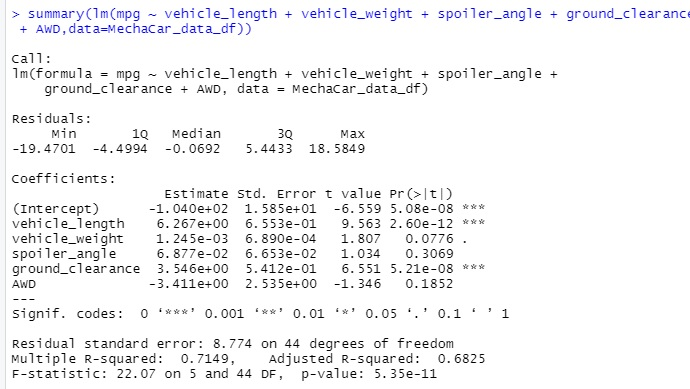
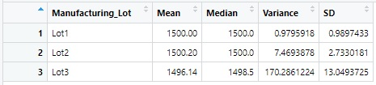

# MechaCar_Statistical_Analysis

## Linear Regression to Predict MPG

Here, we perform a linear regression on the data to see the relationships, if any, mpg has with the other variables.

The data shows a statistically significant relationship between mpg and both ground clearance and vehicle length.  This means these two variables seem to have a non-random amount of variance to the mpg values.

Because the p-values of these two are about 5 x 10^8, much smaller than our assumed significance of 0.05,  we can reject our null hypothesis and assume the slope of those linear models to be non-zero.

An r-squared value over 0.71 means our liner regression model exhibits potentially strong predictive power.

## Summary Statistics on Suspension Coils

Below is a table containing summary statistics for suspension coil weight capacity in PSI.

And following here is a summary of the same coils and PSI findings grouped by production lot.

If we were to look at the overall summary, we would see acceptable numbers.  A variance of about 62 pounds per square inch is below  100, the threshold for acceptable variance set by the company, MechaCar.  However, when looking at the variance by lot, we can see that most of the coil variation comes from Lot 3.  Lot 3 variance measures at 170 PSI, falling far outside the acceptable threshold of 100.
